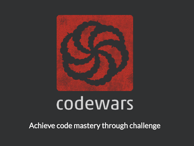

# Code Vault

## CodeWars Challenges



<p align="center">
    
</p>

### 001_Thu_Apr_28_2022_13_23_09_GMT_0200

Given an array of integers your solution should find the smallest integer.

For example:

Given [34, 15, 88, 2] your solution will return 2
Given [34, -345, -1, 100] your solution will return -345
You can assume, for the purpose of this kata, that the supplied array will not be empty.

### Solution

```javascript
const fn = (arr) => {
  return Math.min(...arr);
};
```

another solution

```javascript
const fn = (arr) => {
  return arr.sort((a, b) => a - b)[0];
};
```

---

### 002_Fri_Apr_29_2022_01_18_23_GMT_0200

Complete the solution so that it splits the string into pairs of two characters. If the string contains an odd number of characters then it should replace the missing second character of the final pair with an underscore ('\_').

Examples:

- 'abc' => ['ab', 'c_']
- 'abcdef' => ['ab', 'cd', 'ef']

### Solution

```javascript
const fn = (str) => {
  let arr = [];
  let pairs = "";

  if (str.length % 2 == 0) {
    for (let i = 0; i < str.length; i++) {
      pairs += str[i];
      if (pairs.length < 2) {
        continue;
      } else {
        arr.push(pairs);
        pairs = "";
      }
    }
  } else {
    for (let i = 0; i < str.length; i++) {
      pairs += str[i];
      if (i == str.length - 1) {
        pairs += "_";
        arr.push(pairs);
      } else {
        if (pairs.length < 2) {
          continue;
        } else if (str[i] == str.length - 1) {
          pairs += "_";
          arr.push(pairs);
        } else {
          arr.push(pairs);
          pairs = "";
        }
      }
    }
  }

  return arr;
};
```

---

### 003_Sun_May_01_2022_14_47_07_GMT_0200

Complete the method that takes a boolean value and return a "Yes" string for true, or a "No" string for false.

### Solution

```javascript
const fn = (bool) => {
  if (bool) {
    return "Yes";
  } else {
    return "No";
  }
};
```

---

### 004_Sun_May_01_2022_16_57_26_GMT_0200

Create a function with two arguments that will return an array of the first (n) multiples of (x).

Assume both the given number and the number of times to count will be positive numbers greater than 0.

Return the results as an array (or list in Python, Haskell or Elixir).

Examples:

countBy(1,10) === [1,2,3,4,5,6,7,8,9,10]
countBy(2,5) === [2,4,6,8,10]

### Solution

```javascript
const fn = (x, n) => {
  let arr = [];
  for (let i = 1; i <= n; i++) {
    arr.push(x * i);
  }

  return arr;
};
```

---
